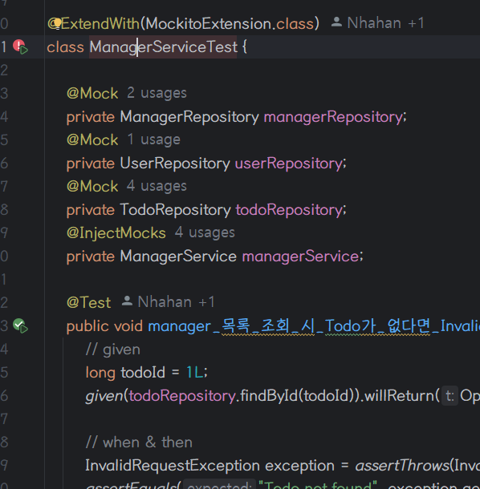

# SPRING ADVANCED 테스트 커버리지

---

## **1.ExpertApplicationTests 테스트 코드 전체 실행**

**커버리지 확인**

**실제 커버 여부**

------
## **2.PasswordEncoderTest 테스트 코드 전체 실행**

**커버리지 확인**

**실제 커버 여부**

->100% 실행. 테스트 코드 문제 없음.

-----
## **3.CommentServiceTest 테스트 코드 전체 실행**

**커버리지 확인**

v

**실제 커버 여부**

->  CommentService의 save는 잘 테스트 됐지만,
getComment는 테스트되지 않음.
getComment를 실행하는 테스트 코드 추가 필요.

----

## **4.ManagerServiceTest 테스트 코드 전체 실행**

**커버리지 확인**

**실제 커버 여부**

-> manager 생성 기능은 테스트 코드가 있지만 에러가 발생하고,
manager 삭제 기능은 테스트 코드가 없음.
수정과 추가 필요.

-----